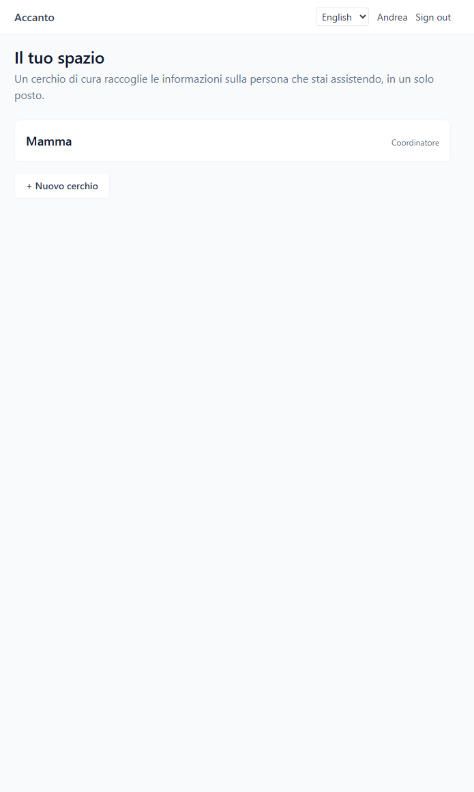
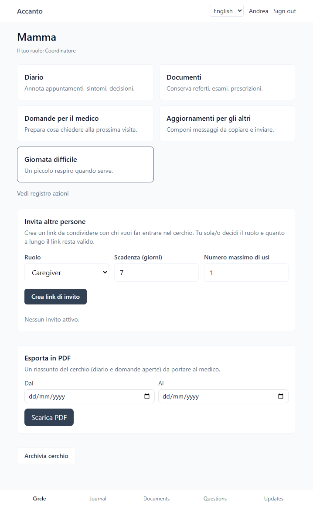
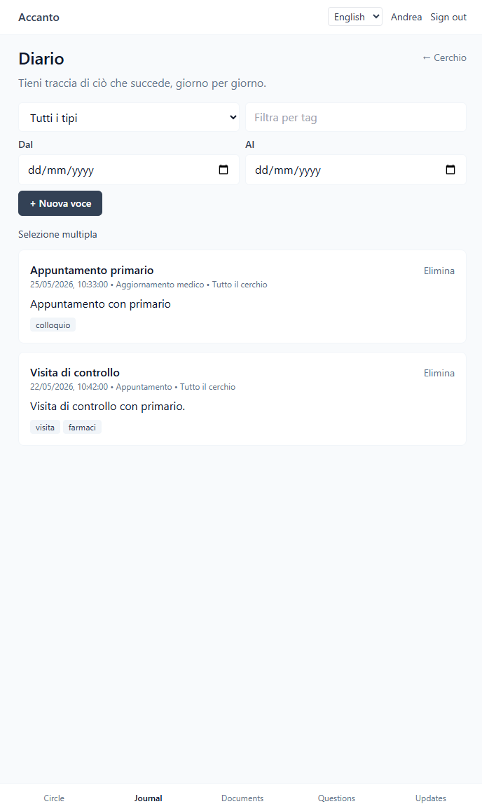
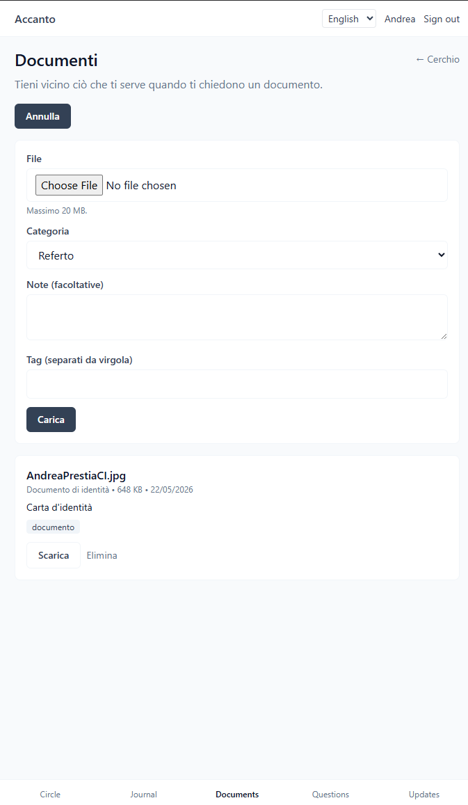
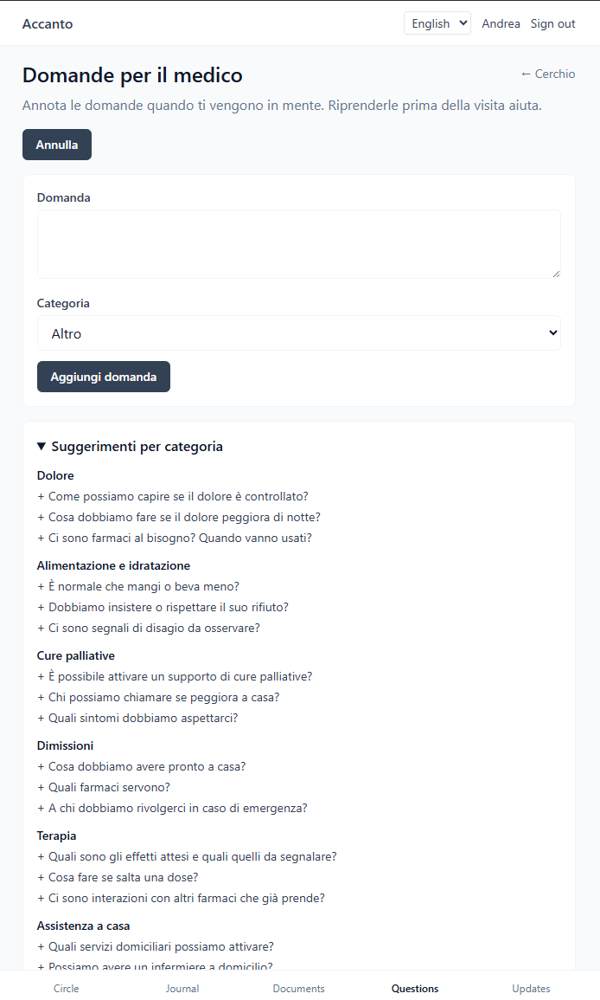
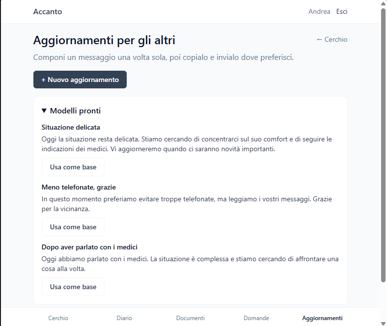
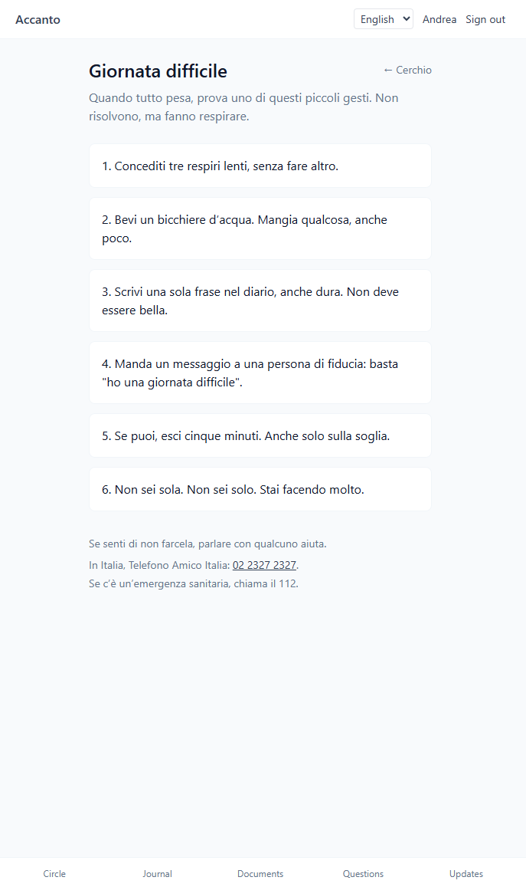
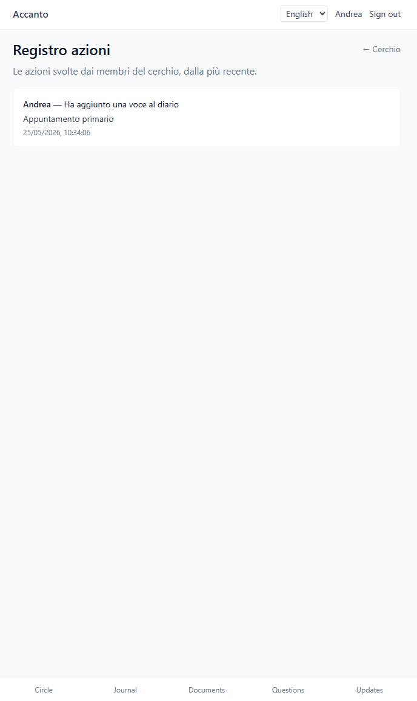
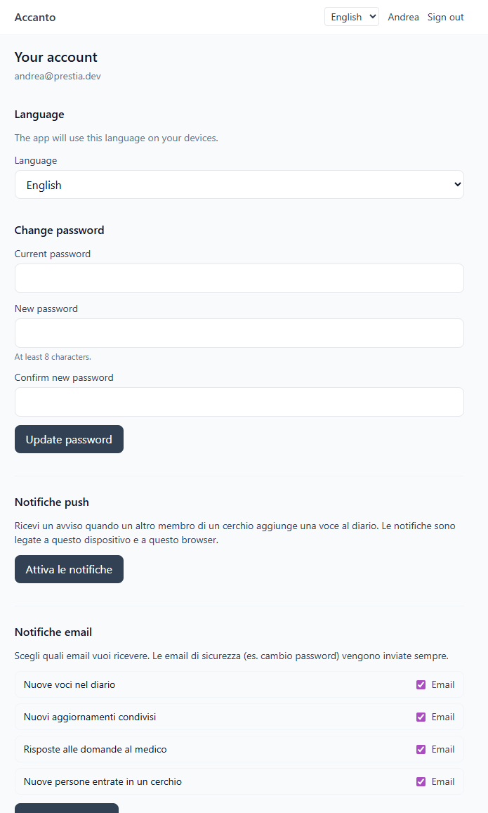

# Accanto

[](https://github.com/AndreaPrestia/Accanto/actions/workflows/ci.yml)
[](https://www.gnu.org/licenses/agpl-3.0)

> Un compagno digitale, sobrio e mobile-first, per chi assiste una persona cara.

Accanto è un'applicazione web open source pensata per i **caregiver familiari**: quei figli, fratelli, partner e amici che si trovano, spesso da un giorno all'altro, a coordinare visite, terapie, documenti e relazioni intorno a una persona malata o fragile. Non è un'app medica. Non sostituisce un medico, uno psicologo, un'assistente sociale. È uno spazio dove tutto ciò che riguarda l'assistenza — appuntamenti, sintomi, referti, domande per il medico, aggiornamenti per i parenti — può vivere in un solo posto, con un tono gentile e senza fronzoli.

Il progetto è in **italiano** per scelta: la maggior parte dei caregiver italiani usa quotidianamente strumenti generalisti pensati in inglese o per contesti diversi. Accanto vuole sentirsi famigliare nel modo in cui parla.

> **Nota sulla genesi del progetto.** Accanto è scritto interamente con l'aiuto di **Claude** (Anthropic), usato come agente di sviluppo end-to-end. Architettura, codice backend e frontend, test, configurazione Docker, copy in italiano e questo README sono il risultato di una collaborazione iterativa uomo–agente, con revisione umana sulle scelte di dominio, sulla privacy e sul tono. La scelta di affidarsi a un agente è deliberata: il bisogno reale dei caregiver non aspetta, e questo strumento doveva essere disponibile **il prima possibile per chiunque ne avesse bisogno**, gratuitamente e self-hostable. Il codice è qui, leggibile e auditabile: chiunque può ispezionarlo, forkarlo, contribuire.

---

## Indice

1. [Cosa fa](#cosa-fa)
2. [Screenshot](#screenshot)
3. [Architettura](#architettura)
4. [Stack tecnico](#stack-tecnico)
5. [Requisiti](#requisiti)
6. [Avvio rapido (Docker)](#avvio-rapido-docker)
7. [Sviluppo locale (senza Docker)](#sviluppo-locale-senza-docker)
8. [API e Swagger](#api-e-swagger)
9. [Privacy e dati](#privacy-e-dati)
10. [Modulo AI (opzionale, self-hosted)](#modulo-ai-opzionale-self-hosted)
11. [Roadmap](#roadmap)
12. [Licenza](#licenza)

---

## Cosa fa

Accanto organizza la cura intorno a un **Cerchio di cura** (`CareCircle`): uno spazio dedicato a una persona assistita. Per ogni cerchio puoi:

- **Diario** — annotare eventi, sintomi, appuntamenti, decisioni, note personali, con tag e visibilità (tutto il cerchio o solo io).
- **Documenti** — caricare referti, esami, prescrizioni e scaricarli quando servono. Ogni file viene salvato sul filesystem dell'istanza, mai su servizi terzi.
- **Domande per il medico** — accumulare le domande nei giorni che precedono una visita, con suggerimenti per categoria (diagnosi, terapia, dolore, cure palliative, dimissione, …).
- **Aggiornamenti per gli altri** — comporre messaggi pronti da copiare e inviare a famiglia stretta, parenti, amici. Tre modelli in italiano già inclusi, ispirati a frasi davvero usate dai caregiver.
- **Giornata difficile** — una pagina semplice con piccoli gesti concreti, da aprire quando tutto pesa.

Il **ruolo** di ogni partecipante al cerchio è uno di `Coordinatore` (Owner), `Caregiver`, `In ascolto` (Viewer). I caregiver scrivono, i viewer leggono, il coordinatore può archiviare il cerchio.

L'interfaccia è **mobile-first** e installabile come PWA: aperta dal telefono, si comporta come un'app, anche offline parzialmente (shell e asset cachati).

## Screenshot

Gli screenshot dell'interfaccia sono raccolti in [`docs/screenshots/`](docs/screenshots/). Sono catturati dalla versione corrente in italiano, dal viewport mobile (le viste desktop sono semplici espansioni della stessa griglia).

| Vista | Anteprima |
|---|---|
| Home / lista cerchi |  |
| Dettaglio cerchio |  |
| Diario |  |
| Documenti |  |
| Domande per il medico |  |
| Aggiornamenti per gli altri |  |
| Giornata difficile |  |
| Registro azioni |  |
| Account |  |


## Architettura

Monolite modulare in stile Clean Architecture:

```
backend/
  src/
    Accanto.Domain/           # entità ed enum, nessuna dipendenza
    Accanto.Application/      # servizi, DTO, validator, contratti (IAccantoDbContext, IFileStorage, …)
    Accanto.Infrastructure/   # EF Core, PostgreSQL, JWT, PBKDF2, storage locale
    Accanto.Api/              # ASP.NET Core Web API, controller REST, middleware
  tests/
    Accanto.Tests/            # xUnit + InMemory + WebApplicationFactory

frontend/                     # Vite + React 18 + TypeScript + Tailwind + PWA
```

Decisioni esplicite:

- L'`Application` referenzia EF Core via `IAccantoDbContext`. Pragmatismo > purezza assoluta.
- Le entità usano enum stringa via `HasConversion<string>()`; i `Tags` sono `text[]` nativi Postgres (per supportare `Contains` in LINQ).
- Validazione con **FluentValidation** + filter MVC che restituisce `422 Unprocessable Entity`.
- Errori applicativi tipizzati (`NotFoundException`, `ForbiddenException`, `ConflictException`, `AppValidationException`) mappati a HTTP status nel middleware.
- Autorizzazione per cerchio centralizzata in `CareCircleAuthorization`: richiede appartenenza + ruolo minimo (Owner < Caregiver < Viewer per ordinale, più alto = meno privilegi).

## Stack tecnico

**Backend**

- .NET 10 / ASP.NET Core Web API
- Entity Framework Core 10 + Npgsql
- PostgreSQL 16
- JWT bearer (HS256) + PBKDF2 (HMACSHA256, 100k iters, salt 16 byte, hash 32 byte)
- FluentValidation
- Swashbuckle / OpenAPI

**Frontend**

- Vite + React 18 + TypeScript
- Tailwind CSS (palette sobria slate)
- React Router v6
- axios
- `vite-plugin-pwa` (manifest + service worker)

**Sito vetrina** (cartella [`web/`](web/))

- Astro 4 (output statico, zero JS di default)
- Tailwind CSS (stessa palette `accanto-*` della SPA)
- Trilingua: italiano (canonical), inglese, spagnolo
- Pagine: home, funzioni, per chi è, privacy, FAQ, prezzi, contatti
- SEO: hreflang, canonical, OpenGraph, sitemap, robots.txt
- Indipendente dalla SPA; pensato per essere servito sul dominio apex (es. `accanto.example`) mentre la SPA vive su `app.accanto.example`. Vedi [`web/README.md`](web/README.md).

**Infrastruttura**

- Docker / docker-compose (db + backend + frontend dietro nginx)

## Requisiti

- Docker + docker-compose **oppure**
- .NET SDK 10.0.x + Node.js 22.x + PostgreSQL 16

## Avvio rapido (Docker)

1. Copia il file `.env.example` in `.env` e imposta almeno una `Jwt__Key` lunga (≥ 32 caratteri) e una `POSTGRES_PASSWORD` non banale.
2. Avvia lo stack:

   ```sh
   docker compose up --build
   ```

3. Apri il browser:
   - Frontend (PWA): http://localhost:5173
   - Sito vetrina:   http://localhost:4321
   - Backend health: http://localhost:8080/health
   - Swagger: http://localhost:8080/swagger

Il frontend è servito da **nginx** e fa da reverse proxy a `/api/` verso il backend, quindi tutto passa per `localhost:5173`. Il sito vetrina (cartella [`web/`](web/)) è un sito statico Astro indipendente, esposto su `localhost:4321`: non chiama il backend e non condivide stato con la SPA.

I file caricati vivono in `./storage/` sul filesystem host (volume montato in `/data/storage` dentro il container). Il database vive nel volume `db-data`.

### Deploy in produzione (con TLS automatico via Caddy)

Per esporre Accanto su un dominio pubblico con HTTPS automatico (Let's Encrypt):

1. Decidi i due domini:
   - **apex** (`ACCANTO_DOMAIN`, es. `accanto.example.com`) → sito vetrina
   - **sottodominio app** (`ACCANTO_APP_DOMAIN`, default `app.${ACCANTO_DOMAIN}`) → SPA + API

   Punta DNS (`A`/`AAAA`) di **entrambi** al server e apri le porte **80** e **443**. Caddy gestisce un singolo certificato SAN per i due hostname.
2. Compila `.env` con segreti veri (`Encryption__MasterKey`, `Jwt__Key`, `POSTGRES_PASSWORD`).
3. Avvia con il file di override:

   ```sh
   ACCANTO_DOMAIN=accanto.example.com \
   ACCANTO_APP_DOMAIN=app.accanto.example.com \
   ACCANTO_TLS_EMAIL=tu@example.com \
   ASPNETCORE_ENVIRONMENT=Production \
   docker compose -f docker-compose.yml -f docker-compose.prod.yml up -d --build
   ```

In produzione né Postgres né il backend sono esposti su internet: solo Caddy ascolta su 80/443 e fa da reverse proxy. La configurazione vive in [deploy/Caddyfile](deploy/Caddyfile).

Topologia HTTPS finale:

| URL                                         | Container | Contenuto                  |
|---------------------------------------------|-----------|----------------------------|
| `https://${ACCANTO_DOMAIN}`                 | `web`     | Sito vetrina (Astro)       |
| `https://${ACCANTO_APP_DOMAIN}`             | `frontend`| SPA React                  |
| `https://${ACCANTO_APP_DOMAIN}/api/*`       | `backend` | API REST                   |
| `https://${ACCANTO_APP_DOMAIN}/health`      | `backend` | Health check               |

La CORS del backend (`Cors__AllowedOrigins`) è preconfigurata per accettare solo `https://${ACCANTO_APP_DOMAIN}`: se in dev ti serve includere altre origini, sovrascrivi la variabile in `.env`.

## Sviluppo locale (senza Docker)

### Backend

```sh
cd backend
# Imposta la connessione (oppure modifica appsettings.Development.json)
dotnet run --project src/Accanto.Api
```

In dev, l'app prova ad applicare le migrazioni in automatico all'avvio. Per crearne di nuove:

```sh
cd backend/src/Accanto.Infrastructure
dotnet ef migrations add NomeMigrazione --startup-project ../Accanto.Api
```

Test:

```sh
cd backend
dotnet test
```

### Frontend

```sh
cd frontend
npm install
npm run dev
```

Imposta `VITE_API_BASE_URL=http://localhost:8080/api` se sviluppi il frontend separato dal backend (o usa un proxy in `vite.config.ts`). In produzione (Docker) il valore di default `/api` funziona già.

### Test end-to-end (Playwright)

Lo stack deve essere in esecuzione (`docker compose up -d`). Poi:

```sh
cd frontend
npm run e2e:install   # solo la prima volta: scarica il browser headless
npm run e2e           # esegue la suite (pagine pubbliche, auth, check-in benessere)
npm run e2e:ui        # apre la UI interattiva di Playwright
```

Le specifiche stanno in `frontend/e2e/`. Per puntare a un'istanza diversa imposta `E2E_BASE_URL=https://...`.

## API e Swagger

Elenco non esaustivo (per i dettagli completi vedi Swagger):

**Auth & account** — `POST /api/auth/register`, `POST /api/auth/login`, `GET /api/auth/me`, `POST /api/auth/2fa/*`, `POST /api/auth/refresh`, `POST /api/auth/logout`, `GET/POST/DELETE /api/account/sessions`, `GET /api/account/audit`, `POST /api/account/wellness-checkins`, `GET /api/account/export` (GDPR).

**Cerchi di cura** — `GET/POST/PUT/DELETE /api/care-circles[/{id}]`, `POST /api/care-circles/{id}/archive`, `GET /api/care-circles/{id}/export` (PDF/ZIP).

**Inviti** — `GET/POST/DELETE /api/care-circles/{id}/invites`, `POST /api/invites/{token}/accept`.

**Contenuti del cerchio** — `GET/POST/PUT/DELETE /api/care-circles/{id}/timeline`, `…/documents` + `/download`, `…/doctor-questions`, `…/shared-updates`.

**Template** — `GET /api/doctor-question-templates`, `GET /api/shared-update-templates`.

**Audit & registro** — `GET /api/care-circles/{id}/audit`.

**Notifiche push** — `GET/POST/DELETE /api/push/subscriptions`, preferenze topic.

**AI (opzionale)** — `GET /api/ai/status`, `PUT /api/care-circles/{id}/ai/settings`, `POST /api/care-circles/{id}/ai/timeline-summary`, `…/doctor-question-draft`, `…/rephrase`, `POST /api/me/ai/checkin-reflection`, `GET /api/ai/interactions[/{id}]`, `POST /api/ai/interactions/{id}/feedback`.

Swagger UI: `http://localhost:8080/swagger`.

## Privacy e dati

Accanto è progettato per essere **self-hostable** (sul tuo PC, su un piccolo VPS, in una intranet). Non esiste un servizio centralizzato Accanto SaaS. Nessun dato lascia mai l'istanza che gestisci.

- Le password sono salvate solo come hash PBKDF2 con salt unico per utente.
- I documenti restano sul filesystem dell'istanza, mai inviati altrove.
- Nessuna telemetria, nessun tracker, nessun analytics di default.
- I JWT scadono entro la durata configurata (`Jwt__ExpiryMinutes`, default 480 minuti).

### Cifratura a riposo

Trattandosi di dati sensibili (annotazioni cliniche, documenti medici), Accanto cifra a livello applicativo i campi e i file più riservati prima di scriverli su disco:

- **AES-256-GCM** con nonce casuale per record e tag di autenticità (16 byte).
- **Campi DB cifrati**: titolo e contenuto del diario, domande e note per il medico, contenuto degli aggiornamenti famiglia, note e nome originale dei documenti medici, descrizione del cerchio.
- **Blob dei documenti** caricati: cifrati in memoria prima della scrittura su disco; decifrati on-demand al download.
- **Tag e metadati strutturali** (date, tipi, ruoli) restano in chiaro per consentire ricerca e filtri.

La chiave master è una stringa **base64 da 32 byte** fornita via variabile d'ambiente `Encryption__MasterKey`. Generala una volta sola con:

```bash
openssl rand -base64 32
```

> ⚠️ **Attenzione**: se perdi la chiave perdi i dati cifrati. Conservala in un gestore di segreti (vault) o almeno in un backup separato dal database.

**Rotazione chiave (opzionale)**. È supportato un formato a più chiavi: imposta `Encryption__Keys__<keyId>=<base64-32B>` per ogni chiave e `Encryption__ActiveKeyId=<keyId>` per scegliere quella attiva (le nuove scritture usano il formato `v2.<keyId>.…`; le letture restano retrocompatibili con il formato `v1.` della `MasterKey`). Il `KeyRotationService` riscrive in background i record esistenti con la chiave attiva.

**Restano a carico di chi fa il deploy**:

- cifratura del disco (LUKS, BitLocker, dm-crypt sul volume Postgres e sul volume dei documenti);
- terminazione TLS (reverse proxy: Caddy, Traefik, nginx) — il `docker-compose` di esempio espone solo HTTP in locale;
- backup cifrati del database e della directory `storage/`, includendo SEPARATAMENTE la chiave master (vedi sotto);
- politiche di accesso al server e rotazione delle credenziali Postgres.

### Backup e recovery

Tre cose vanno salvate **insieme** per poter ricostruire un'istanza, ma conservate **in posti diversi**:

| Cosa | Dove vive | Perché | Frequenza minima |
|---|---|---|---|
| **Dump Postgres** (`db-data`) | volume `db-data` | tutti i metadati: utenti, cerchi, voci diario, audit, interazioni AI cifrate | giornaliera |
| **Directory `storage/`** | bind mount `./storage` → `/data/storage` | blob documenti **cifrati** (AES-GCM) | giornaliera |
| **Master key** (`Encryption__MasterKey` + eventuali `Encryption__Keys__*`) | `.env` sul server | senza, i punti sopra sono ciphertext inutilizzabile | una volta sola, copia off-line in vault |

> ⚠️ Master key e backup devono vivere in **luoghi separati**: chi accede al backup senza la chiave vede solo ciphertext; chi accede alla chiave senza il backup non ha nulla. Se finiscono nella stessa cartella il livello di sicurezza torna a zero.

Esempio minimo con [restic](https://restic.net/) verso un bucket esterno (Backblaze B2, Wasabi, S3, SFTP):

```bash
# .env del backup (file separato, mode 600) — NON nella stessa repo
export RESTIC_REPOSITORY="b2:accanto-backup:/server-1"
export RESTIC_PASSWORD="…32+ caratteri random, separato dal master key…"
export B2_ACCOUNT_ID="…" B2_ACCOUNT_KEY="…"

# Prima volta
restic init

# Backup notturno (cron)
docker compose exec -T db pg_dump -U accanto accanto | gzip > /tmp/accanto.sql.gz
restic backup /tmp/accanto.sql.gz ./storage
rm /tmp/accanto.sql.gz
restic forget --keep-daily 14 --keep-weekly 8 --keep-monthly 12 --prune
```

Verifica periodica (mensile): `restic check` + restore di prova in una directory temporanea.

**Restore da zero** su un server nuovo:

```bash
# 1. Stack su, ma SENZA backend (lascia che il db si inizializzi vuoto)
docker compose up -d db

# 2. Reimporta il dump nel volume db-data
restic restore latest --target /tmp/restore
gunzip -c /tmp/restore/accanto.sql.gz | docker compose exec -T db psql -U accanto -d accanto

# 3. Ripristina i blob cifrati
cp -r /tmp/restore/storage/* ./storage/

# 4. Imposta nel .env la STESSA Encryption__MasterKey originale (dal vault!),
#    poi avvia il resto:
docker compose up -d
```

Se la master key non corrisponde, il backend si avvia ma ogni decifratura fallisce con `AuthenticationTagMismatchException`: è il segnale che hai recuperato dati ma con la chiave sbagliata.

**Disclaimer**: Accanto non è un dispositivo medico, non sostituisce nessuna figura sanitaria, non offre diagnosi né consigli terapeutici. È uno strumento di **organizzazione personale**.

## Modulo AI (opzionale, self-hosted)

Da v0.2 è disponibile un **assistente AI opzionale**, completamente self-hosted tramite [Ollama](https://ollama.com). Niente provider esterni, niente API key, niente dati che lasciano il tuo server.

### Cosa fa

Tutte le funzioni sono attivabili una per una e producono testo **sempre editabile** prima di essere salvato. Il disclaimer "non sostituisce un medico" accompagna ogni risposta.

- **Riassunto del diario** — sintesi degli ultimi N giorni di voci, per prepararsi a una visita.
- **Bozza di domande per il medico** — 3 proposte a partire da un argomento.
- **Riformulazione gentile** di un aggiornamento per i familiari (tono neutro/caldo/sintetico).
- **Riflessione personale** sui propri check-in di benessere (solo per te, mai condivisa col cerchio).

### Come si attiva

Di default l'AI è **spenta** a livello di sistema (`Ai__Provider=none`) e di singolo cerchio (`CareCircle.AiEnabled=false`). Per abilitarla:

1. Avvia lo stack con il profilo `ai`:
   ```bash
   docker compose --profile ai up -d
   ```
   Questo aggiunge il servizio `ollama` (immagine `ollama/ollama:latest`, volume persistente `ollama-data`).

2. Scarica il modello al primo avvio (~2 GB):
   ```bash
   docker compose exec ollama ollama pull llama3.2:3b
   ```

3. Nel file `.env` imposta:
   ```env
   Ai__Provider=ollama
   Ai__Endpoint=http://ollama:11434
   Ai__Model=llama3.2:3b
   ```
   e ricrea il backend: `docker compose up -d backend`.

4. Nelle impostazioni del singolo cerchio, l'owner può ora attivare il toggle "Abilita assistente AI per questo cerchio".

### Scelta del modello e qualità in italiano

Il frontend invia l'header `Accept-Language` (dalla lingua UI corrente) e il backend genera un system prompt che impone esplicitamente la lingua di risposta. Tuttavia i modelli piccoli possono occasionalmente rispondere in inglese: è un comportamento del modello, non un bug.

Modelli consigliati (da modificare in `Ai__Model` nel `.env`, poi `docker compose exec ollama ollama pull <modello>` e `docker compose up -d backend`):

| Modello | Dimensione | RAM | Italiano | Note |
|---|---|---|---|---|
| `llama3.2:3b` | ~2 GB | ~3-4 GB | discreto | default, veloce, ok su CPU |
| `llama3.1:8b` | ~4.7 GB | ~8 GB | buono | qualità nettamente migliore in italiano |
| `qwen2.5:7b` | ~4.4 GB | ~7 GB | buono | ottimo multilingua, sintesi pulita |
| `qwen2.5:1.5b` | ~1 GB | ~2 GB | scarso | per VPS minimali, solo prototipi |

### Requisiti hardware

`llama3.2:3b` richiede ~3-4 GB di RAM e risponde in 1-3 secondi su CPU moderna. Modelli da 7-8B richiedono ~8 GB di RAM libera e rispondono in 5-15 secondi su CPU; con GPU il tempo crolla.

### Garanzie

- **Tre livelli di guardrail**:
  1. *Input* — pattern regex + FluentValidation rifiutano tentativi di prompt injection ("ignora le istruzioni…", "act as DAN", ecc.), argomenti fuori scope (politica, trading, codice) e individuano segnali di autolesionismo per rispondere con i contatti di supporto.
  2. *Prompt hardening* — system prompt che fissa l'ambito caregiving + sandwich di "regola finale" ripetuta dopo l'input utente; ogni risposta fuori scope deve essere la sentinella `fuori_scopo`.
  3. *Output* — sentinella + cap di lunghezza + redazione PII; con `Ai__SelfCheckEnabled=true` il modello viene interrogato una seconda volta per dichiarare "questa risposta è coerente?". Disabilitato di default: su modelli piccoli (3B) il reviewer tende a bloccare risposte legittime; abilitare solo con modelli 8B+.
- **Persistenza cifrata** di ogni interazione (`AiInteraction`, AES-256-GCM via `IFieldProtector`): l'utente può rileggere input + output dal proprio storico ("Cronologia AI" in Account), l'owner del cerchio vede le interazioni di cerchio degli altri membri (escluse le riflessioni personali).
- **Feedback** 👍 / 👎 / 🚩 su ogni risposta, salvato come parte dell'interazione (utile per migliorare prompt e modello).
- **Cache idempotency 1 h** per input identici nello stesso scope (utente+cerchio+funzione): risparmia chiamate e mostra `X-AI-Cache: hit` nella risposta.
- **Audit log dedicato**: ogni chiamata AI viene registrata (funzione, provider, durata, verdetto del guardrail) **senza contenuto** in chiaro.
- **Rate limit dedicato** (bucket `ai`, default 20 chiamate/ora per utente).
- Lo stack base (`docker compose up`) **non** avvia Ollama: profilo opzionale.

## Roadmap

### Rilasciato

**v0.1** — Cerchi di cura, diario, documenti, domande per il medico, aggiornamenti pronti da copiare, giornata difficile. Autenticazione email+password, PWA installabile.

**v0.2** — Inviti via link, promemoria visite con notifiche push (Web Push/VAPID), esportazione PDF del cerchio, filtri data nel diario.

**v0.3** — Registro azioni di cerchio (audit log), email opzionali via SMTP/MailKit, editing in massa del diario, trilingua `it`/`en`/`es` (backend + frontend + email + PDF su `PreferredLanguage`), esportazione GDPR (ZIP utente + documenti decifrati), rotazione chiavi di cifratura (`v2.<keyId>.…`, retrocompat `v1.`).

**v0.4 — Sicurezza & account** — Rate limiting per endpoint sensibili, refresh token con rotation + reuse detection, sessioni attive revocabili da `/account`, lockout temporaneo, 2FA TOTP + codici di recupero (Otp.NET), audit log eventi auth.

**v0.5 — Cura di chi cura** — Check-in emotivo privato del caregiver (umore/energia/stress + nota) con trend 30 giorni, pagina `/support` con contatti italiani, pagina `/self-care` con micro-promemoria e segnali di burnout.

**v0.6** — Sito vetrina trilingua ([`web/`](web/)), deploy in produzione con Caddy + TLS automatico, estensione test E2E (Playwright) e a11y.

**v0.7 — Modulo AI (Ollama) end-to-end** — Provider locale via Ollama, 4 funzioni (riassunto diario, bozza domande, riformulazione, riflessione check-in), guardrail a 3 livelli (input/prompt/output) con sentinella `fuori_scopo`, cache idempotency 1 h, rate limit dedicato per utente, persistenza cifrata di ogni interazione (`AiInteraction`, AES-256-GCM), cronologia AI personale + visibilità owner sul cerchio, feedback 👍 / 👎 / 🚩, self-check disabilitabile per modelli piccoli (default off).

### Idee future

- Backup/restore guidato dell'istanza con verifica della chiave di cifratura.
- Estrazione di entità strutturate (date, farmaci, dosaggi) dai testi liberi del diario.
- Supporto per altri provider locali (llama.cpp diretto, vLLM) tramite l'astrazione `IAiAssistant`.
- Supporto opzionale per provider esterni con consenso informato esplicito (off di default).

## Licenza

Accanto è rilasciato sotto licenza **GNU Affero General Public License v3.0 (AGPL-3.0)**. Vedi [LICENSE](LICENSE).

Questa scelta è deliberata: chiunque modifichi Accanto e lo offra come servizio web ad altri deve a sua volta rendere disponibile il codice sorgente delle proprie modifiche. Sembra giusto, per uno strumento che tocca i momenti più delicati della vita delle persone.

## Contribuire

Vedi [CONTRIBUTING.md](CONTRIBUTING.md). Per vulnerabilità di sicurezza, [SECURITY.md](SECURITY.md).
