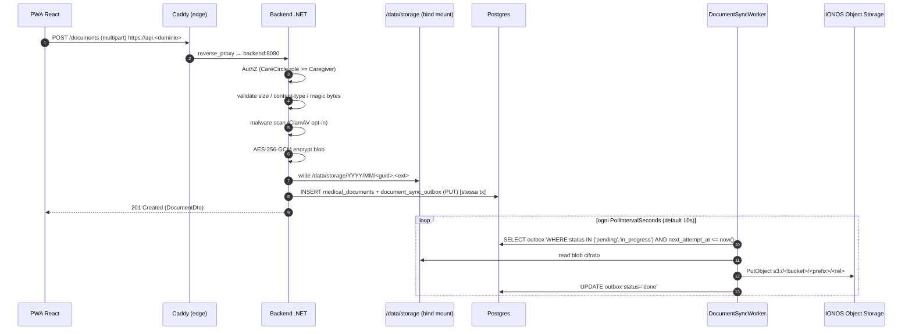

# Document storage: upload pipeline e replica IONOS

Documento di riferimento per il ciclo di vita dei documenti caricati dagli
utenti (referti medici, ecc.). Copre:

- il flusso end-to-end di un upload, dal browser fino allo storage
  cifrato a riposo;
- la replica asincrona via S3 (IONOS Object Storage) e l'outbox che la
  governa;
- il GDPR right-to-erasure tramite cascade sull'outbox;
- il layout del filesystem nel container backend e i requisiti di
  ownership/permission;
- la configurazione (env vars, appsettings) e i default sicuri;
- la storia dei bug e delle fix shippate fino a `v0.11.2`.

---

## 1. Architettura in 30 secondi



**Punti chiave**:

- L'unica fonte autoritativa è il filesystem locale `/data/storage`.
  S3 è una *replica* (per disaster recovery), non lo storage primario.
- I byte salvati su disco e su S3 sono **già cifrati** AES-256-GCM con
  `Encryption__MasterKey`. Il backend non manda mai plaintext fuori dal
  processo.
- L'outbox è scritta nella **stessa transazione** del documento → niente
  divergenza fra DB e replica anche se il processo crasha fra `INSERT` e
  `PUT`.
- La cancellazione (DELETE documento o GDPR right-to-erasure) usa lo
  stesso outbox con `Operation='DELETE'` → idempotente, ricoverabile in
  caso di fallimento del PUT/DELETE su S3.

---

## 2. Componenti coinvolti

| Componente | File | Ruolo |
|---|---|---|
| Endpoint HTTP | [backend/src/Accanto.Api/Controllers/DocumentsController.cs](backend/src/Accanto.Api/Controllers/DocumentsController.cs) | Bind multipart → DTO, applica auth + rate-limit |
| Application service | [backend/src/Accanto.Application/Documents/DocumentService.cs](backend/src/Accanto.Application/Documents/DocumentService.cs) | Orchestrazione: AuthZ, validazione, malware, persistenza, outbox, audit |
| Validator content | [backend/src/Accanto.Application/Documents/FileSignatureValidator.cs](backend/src/Accanto.Application/Documents/FileSignatureValidator.cs) | Magic bytes + estensione + struttura (anti polyglot) |
| Antivirus | [backend/src/Accanto.Infrastructure/Storage/ClamAvMalwareScanner.cs](backend/src/Accanto.Infrastructure/Storage/ClamAvMalwareScanner.cs) | INSTREAM su `clamd`. No-op se `ClamAV__Host` vuoto |
| Storage primario | [backend/src/Accanto.Infrastructure/Storage/LocalFileStorage.cs](backend/src/Accanto.Infrastructure/Storage/LocalFileStorage.cs) | AES-256-GCM + write su disco con path traversal guard |
| Outbox dispatcher | [backend/src/Accanto.Infrastructure/Storage/DocumentSyncWorker.cs](backend/src/Accanto.Infrastructure/Storage/DocumentSyncWorker.cs) | BackgroundService, polling + backoff esponenziale |
| Replica S3 | [backend/src/Accanto.Infrastructure/Storage/S3DocumentReplica.cs](backend/src/Accanto.Infrastructure/Storage/S3DocumentReplica.cs) | `PutObject` / `ListVersions` + `DeleteObject` per ogni versione |
| GDPR erasure | [backend/src/Accanto.Application/Account/UserErasureService.cs](backend/src/Accanto.Application/Account/UserErasureService.cs) | Tombstone utente + cascade DELETE outbox per ogni documento |
| Config replica | [backend/src/Accanto.Application/Documents/S3DocumentReplicaOptions.cs](backend/src/Accanto.Application/Documents/S3DocumentReplicaOptions.cs) | Bucket, prefix, polling, batch, retries |
| Config storage | [backend/src/Accanto.Infrastructure/Storage/StorageOptions.cs](backend/src/Accanto.Infrastructure/Storage/StorageOptions.cs) | RootPath, MaxFileSizeBytes, AllowedContentTypes |

---

## 3. Pipeline di upload, dettagliata

### 3.1 Endpoint e binding

`POST /documents/{careCircleId}` consuma multipart/form-data:

- `file`: il blob (max 20 MB di default, `Storage__MaxFileSizeBytes`).
- `category`, `notes`, `tags[]`: metadati.

Caddy in front, `request_body { max_size 25MB }` per stoppare upload
abusivi prima ancora che arrivino al .NET (margine sopra il limite app
per overhead multipart).

### 3.2 Authorization

`ICareCircleAuthorization.EnsureMemberAsync(userId, careCircleId, Caregiver)`
→ deve essere almeno `Caregiver` nel circolo. Lancia `ForbiddenException`
(404/403) se no.

### 3.3 Validazione (DocumentService.UploadAsync)

In ordine, prima ancora di toccare il disco:

1. `SizeInBytes > 0`;
2. `SizeInBytes <= MaxFileSizeBytes` (default 20 MB);
3. `ContentType` ∈ `AllowedContentTypes` (PDF, JPEG, PNG, WEBP, …);
4. `OriginalFileName` non vuoto;
5. Buffer dello stream completo in `MemoryStream` (size già limitata);
6. **`FileSignatureValidator.Validate`** — controlla:
   - magic bytes coerenti col content-type dichiarato (anti-spoofing);
   - estensione coerente;
   - presenza di magics noti pericolosi (script, eseguibili) anche dentro
     contenitori (anti-polyglot);
7. **Malware scan** — `IMalwareScanner.ScanAsync`:
   - default `NoopMalwareScanner` (dev/test);
   - `ClamAvMalwareScanner` se `ClamAV__Host` configurato (INSTREAM su
     `clamd`, timeout `ClamAV__TimeoutSeconds`);
   - `MalwareDetectedException` → 422 con `signature` nel body.

Tutte queste validazioni mappano a 422 *Unprocessable Entity* via
`AppValidationException` + `ValidationFilter`.

### 3.4 Persistenza filesystem

`LocalFileStorage.SaveAsync` (chiamata sul buffer validato):

1. `ext = SanitizeExtension(Path.GetExtension(originalFileName))` —
   solo letter+digit+`.`, max 16 char.
2. Sub-dir `YYYY/MM` (UTC). `Directory.CreateDirectory` se non esiste.
3. `internalName = Guid.NewGuid().ToString("N") + ext` — non si fida mai
   del nome originale per il path.
4. `relative = "YYYY/MM/<guid>.<ext>"`.
5. `EnsureWithinRoot(fullPath)` — guard contro path traversal: il
   percorso assoluto risolto deve iniziare con `_rootFull + sep`.
6. `IFieldProtector.EncryptBytes(plaintext)` — AES-256-GCM con la master
   key (la stessa che cifra colonne sensibili).
7. `FileStream(FileMode.CreateNew)` per evitare overwrite accidentale
   anche con guid colliso (impossibile in pratica, ma fail-fast).
8. Restituisce `StoredFile(internalFileName, relativePath, plaintextSize)`
   — `SizeInBytes` registrato in DB è la dimensione del **plaintext**
   (significativa per l'utente).

### 3.5 Persistenza DB + outbox (atomica)

`DocumentService.UploadAsync` continua:

```csharp
_db.MedicalDocuments.Add(doc);          // riga in medical_documents
EnqueueOutbox(doc.Id, doc.StoragePath, "PUT");  // riga in document_sync_outbox
await _db.SaveChangesAsync(...);        // UNICA transazione
```

Se `SaveChangesAsync` fallisce, **né il documento né l'outbox vengono
persistiti**. Il file su disco resta orfano ma ci pensa lo sweep
periodico o il prossimo upload con stesso GUID (impossibile in pratica).

### 3.6 Audit log fire-and-forget

```csharp
_ = _audit.LogAsync(careCircleId, userId, AuditActionType.DocumentUploaded,
                    AuditResourceType.MedicalDocument, doc.Id, doc.OriginalFileName,
                    CancellationToken.None);
```

`CancellationToken.None` (non `Context.RequestAborted`) per non perdere
l'audit se il client disconnette dopo il `201`.

### 3.7 Risposta 201

`DocumentDto` con `id`, `fileName`, `originalFileName`, `contentType`,
`sizeInBytes`, `category`, `tags`, `notes`, `createdAt`. Niente
`storagePath` esposto al client.

---

## 4. Replica S3 IONOS (asincrona via outbox)

### 4.1 Outbox table

`document_sync_outbox`:

| Colonna | Tipo | Note |
|---|---|---|
| `Id` | uuid | PK |
| `DocumentId` | uuid | FK logico (no FK fisico per consentire DELETE dopo cascade GDPR) |
| `StoragePath` | text | `YYYY/MM/<guid>.<ext>` |
| `Operation` | text | `PUT` o `DELETE` |
| `Status` | text | `pending` / `in_progress` / `done` / `failed` |
| `RetryCount` | int | contatore tentativi |
| `LastError` | text | message dell'ultima exception (max 1000 char) |
| `NextAttemptAt` | timestamptz | quando rifare il tentativo |
| `CreatedAt`, `UpdatedAt` | timestamptz | telemetria |

Migrazione: `20260619104703_AddDocumentSyncOutbox`.

### 4.2 Worker

`DocumentSyncWorker : BackgroundService`. Polling loop:

```csharp
var batch = await db.DocumentSyncOutbox
  .Where(o => (o.Status == "pending" || o.Status == "in_progress")
              && o.NextAttemptAt <= now)
  .OrderBy(o => o.NextAttemptAt)
  .Take(BatchSize)
  .ToListAsync(ct);
```

Per ogni entry:

- `PUT` → `S3DocumentReplica.PutAsync(storagePath)`;
- `DELETE` → `S3DocumentReplica.DeleteAllVersionsAsync(storagePath)` —
  enumera **tutte le versioni** e le elimina (necessario per GDPR su
  bucket versionati);
- ok → `Status='done'`;
- fail → `RetryCount++`, backoff esponenziale dei tentativi:

| Tentativo | Delay prima del retry |
|---|---|
| 1 | 60 s |
| 2 | 5 min |
| 3 | 30 min |
| 4 | 2 h |
| 5 | 6 h |
| `> MaxRetries` | `Status='failed'` (intervento manuale via SQL) |

Niente DLQ separata: il `Status='failed'` è una "morta letale" finché
un admin non rimette manualmente `Status='pending'` + `NextAttemptAt=now`.

### 4.3 PUT su S3

`S3DocumentReplica.PutAsync`:

1. `ResolveAndGuard(storagePath)` — stesso path traversal guard di
   `LocalFileStorage`.
2. `FileStream` read del **blob già cifrato** (i byte sul disco).
3. `PutObjectRequest`:
   - `Bucket` = `S3DocumentReplica__Bucket`;
   - `Key` = `<Prefix>/YYYY/MM/<guid>.<ext>`;
   - `ContentType = "application/octet-stream"` (è cifrato, niente di
     più specifico è sensato);
   - `DisablePayloadSigning = true` (compatibilità IONOS, evita SHA256
     sull'intero body).

Convenzione bucket: il prefisso `documents/` (default) NON deve avere
Object Lock attivo, perché i documenti devono restare GDPR-erasable.
Object Lock va invece su un altro bucket dedicato ai backup pg_dump
(vedi accanto-ops/backup-restore.md).

### 4.4 DELETE versionato

`DeleteAllVersionsAsync`:

1. `ListVersionsRequest` con `Prefix=key`, paginato 1000 per volta;
2. per ogni `Version` con `Key == key` → `DeleteObjectRequest` con il
   suo `VersionId`;
3. loop finché `NextVersionIdMarker` resta valorizzato.

Risultato: nessuna versione storica recuperabile dell'oggetto. I
delete-marker eventuali restano (non contengono PII) e verranno raccolti
da una lifecycle rule del bucket.

---

## 5. GDPR right-to-erasure (cascade)

`UserErasureService` (chiamato da admin endpoint):

1. SET tombstone sull'utente (`is_erased`, `erased_at`, dati PII
   azzerati).
2. Per **ogni documento** caricato dall'utente o nei suoi care circles
   in cui era proprietario:
   - INSERT outbox `(DocumentId, StoragePath, Operation='DELETE')`;
3. SaveChangesAsync **una sola volta** → tutto in una transazione.
4. Il `DocumentSyncWorker` nei cicli successivi eseguirà la DELETE
   versionata su S3. Idempotente: se la riga locale è già rimossa, la
   `DELETE` su S3 si applica comunque.

---

## 6. Storage layout & permessi container

### 6.1 Struttura su disco

```
/data/storage/                  ← bind mount da ./storage del repo prod
├── 2026/
│   ├── 06/
│   │   ├── 4f3a…b9.pdf         ← AES-256-GCM ciphertext
│   │   └── 8c1e…a2.jpg
│   └── 07/
└── 2027/
    └── 01/
```

- Sub-dir create on-demand (`Directory.CreateDirectory`).
- Owner richiesto: `1654:1654` (utente `app` dell'immagine chiseled
  ASP.NET).
- Permessi minimi: `u+rwX` (writable per uid 1654).

### 6.2 storage-init container (v0.11.1)

In `docker-compose.yml`:

```yaml
storage-init:
  image: busybox:1.36
  restart: "no"
  user: "0:0"
  command: ["sh", "-c", "chown -R 1654:1654 /data/storage && chmod -R u+rwX /data/storage && echo 'storage ownership ok'"]
  volumes:
    - ./storage:/data/storage

backend:
  depends_on:
    db:
      condition: service_healthy
    storage-init:
      condition: service_completed_successfully
```

Idempotente: gira come root prima del backend, fa `chown -R` per
allineare uid/gid; se l'ownership è già corretto è un no-op. Il backend
non parte finché lo storage-init non termina con exit 0.

---

## 7. Configurazione

### 7.1 Backend env vars (lato compose)

| Variabile | Default | Note |
|---|---|---|
| `Storage__RootPath` | `/data/storage` | Mount point dentro container |
| `Storage__MaxFileSizeBytes` | `20971520` (20 MB) | Limite applicativo |
| `ClamAV__Host` | vuoto | Se vuoto, scanner = no-op |
| `ClamAV__Port` | `3310` | INSTREAM clamd |
| `ClamAV__TimeoutSeconds` | `30` | |
| `S3DocumentReplica__Enabled` | `false` | Master switch worker |
| `S3DocumentReplica__ServiceUrl` | vuoto | IONOS: `https://s3-eu-central-1.ionoscloud.com` |
| `S3DocumentReplica__Region` | `us-east-1` | IONOS richiede `eu-central-1` o `de` |
| `S3DocumentReplica__Bucket` | vuoto | Es. `accanto-docs` |
| `S3DocumentReplica__Prefix` | `documents/` | NO Object Lock su questo prefisso |
| `S3DocumentReplica__AccessKeyId` | vuoto | Da segreto IONOS |
| `S3DocumentReplica__SecretAccessKey` | vuoto | Da segreto IONOS |
| `S3DocumentReplica__PollIntervalSeconds` | `10` | Worker polling |
| `S3DocumentReplica__BatchSize` | `10` | Righe outbox per ciclo |
| `S3DocumentReplica__MaxRetries` | `5` | Soglia → `Status='failed'` |
| `Encryption__MasterKey` | required | AES-256-GCM key (32 byte base64) |

### 7.2 Caddy (limite body)

`deploy/Caddyfile` blocco `{$ACCANTO_API_DOMAIN}`:

```caddy
request_body {
  max_size 25MB
}
```

Margine sopra `Storage__MaxFileSizeBytes` per overhead multipart. Caddy
restituisce 413 prima ancora di proxare al backend in caso di abuso.

### 7.3 .env in produzione

Esempio (riferimento, valori reali NON committati):

```env
ACCANTO_VERSION=v0.11.2
ACCANTO_DOMAIN=accanto.care
ACCANTO_APP_DOMAIN=app.accanto.care
ACCANTO_API_DOMAIN=api.accanto.care
ACCANTO_TLS_EMAIL=…

Encryption__MasterKey=…
Jwt__Key=…
POSTGRES_PASSWORD=…
POSTGRES_APP_PASSWORD=…

S3DocumentReplica__Enabled=true
S3DocumentReplica__ServiceUrl=https://s3-eu-central-1.ionoscloud.com
S3DocumentReplica__Region=eu-central-1
S3DocumentReplica__Bucket=accanto-docs
S3DocumentReplica__Prefix=documents/
S3DocumentReplica__AccessKeyId=…
S3DocumentReplica__SecretAccessKey=…

ClamAV__Host=clamav
Email__SmtpHost=smtp.ionos.it
…
```

---

## 8. Storia dei bug e fix

In ordine cronologico, dal più vecchio al più recente:

### 8.1 v0.10.0 — `S3DocumentReplica__Prefix` default coerente

Commit `7ee10b2`. Il default era `storage/`, ma in prod si usa il bucket
dedicato `accanto-docs` con prefisso `documents/`. Spostato il default
nel codice per evitare drift fra appsettings e `.env`.

### 8.2 v0.10.1 — env vars non passate al backend

Commit `9c6bccd`. Le variabili `S3DocumentReplica__*` erano valorizzate
in `.env` ma non venivano *forwardate* al container backend in
`docker-compose.yml`. Sintomo: `S3DocumentReplica__Enabled=true` in `.env`
ma il worker partiva come `Enabled=false`. Fix: aggiunte tutte le righe
`environment: S3DocumentReplica__Xxx: ${...}` al servizio backend.

### 8.3 v0.10.2 — Email/Push/ClamAV env vars

Commit `2cd50a2`. Stesso pattern di v0.10.1 ma per gli altri moduli
opzionali: `Email__*`, `Push__*`, `ClamAV__*` non arrivavano al
container. Senza queste, l'antivirus restava sempre no-op anche con
`clamd` running, e le email non partivano.

### 8.4 v0.11.0 — feature: forgot/reset password

Commit `f7d87c0`. Non tocca lo storage upload, ma ha trascinato fuori il
bug dei permessi (vedi 8.5) perché un nuovo deploy ha ribaltato il
container backend.

### 8.5 v0.11.1 — `storage-init` per ownership `/data/storage`

Commit `a0d6df1`. **Sintomo**:

```
System.UnauthorizedAccessException: Access to the path '/data/storage/2026' is denied.
   at System.IO.FileSystem.CreateDirectory
   at LocalFileStorage.SaveAsync
```

**Causa**: la directory `2026/` era stata creata in passato da un
processo che girava come root (script di amministrazione manuale o un
container backend più vecchio non chiseled). L'immagine attuale ASP.NET
chiseled gira come uid `1654` (utente `app`, vedi `ps -o uid,user,comm`
dentro il container). uid 1654 non aveva write-access dentro `2026/`,
quindi `Directory.CreateDirectory("/data/storage/2026/06")` falliva
appena cambiato il mese o appena si toccava l'esistente.

**Fix**: aggiunto un container `storage-init` (busybox uid 0) che:

- gira **prima** del backend (`depends_on.storage-init.condition:
  service_completed_successfully`);
- esegue `chown -R 1654:1654 /data/storage && chmod -R u+rwX
  /data/storage`;
- è idempotente (no-op se l'ownership è già corretto);
- termina con exit 0 (`restart: "no"`).

**Lezione**: ogni volta che cambi l'utente runtime di un container con
bind mount esistente, devi prevedere un init step di realignment.
L'immagine chiseled ASP.NET .NET 10 usa uid `1654`, NON `64198` (errore
comune nei tutorial datati). Verificare sempre con
`docker exec backend ps -o uid,user,comm`.

### 8.6 v0.11.1 → versione PWA non aggiornata

**Sintomo**: dopo il deploy v0.11.1 la PWA mostrava ancora `v0.10.0` nel
footer; il bug dei permessi sembrava persistere.

**Causa**: `.env` sul server aveva `ACCANTO_VERSION=v0.10.0`. Il `pull`
ha rifatto il pull dell'immagine vecchia.

**Fix**: aggiornato `.env` a `ACCANTO_VERSION=v0.11.1` + `pull` + `up
-d`. Niente codice toccato. Procedura formalizzata nel deploy guide:
*"prima di pull, aggiorna `ACCANTO_VERSION` in `.env`, poi verifica con
`docker compose config | grep image` che le immagini referenziate siano
del tag corretto"*.

### 8.7 v0.11.2 — CSP duplicato che bloccava il login (e quindi anche l'upload)

Commit `67cfb76`. **Sintomo**:

```
Refused to connect to 'https://api.accanto.care/auth/login' because
it violates the following Content Security Policy directive:
"connect-src 'self'".
```

Login PWA impossibile → impossibile testare l'upload. Inizialmente
sembrava un bug correlato al deploy v0.11.1, in realtà era latente da
settimane.

**Causa storica**:

1. `0a1ce0f` — split del dominio API: la SPA smette di chiamare `/api/...`
   same-origin via Caddy reverse_proxy e inizia a chiamare direttamente
   `https://api.accanto.care` (cross-origin).
2. `f51ad97` (sec(tier2), 3 giu 2026) — aggiunto CSP nginx interno con
   `connect-src 'self'`. Il commento "in dev nginx fa anche il reverse
   proxy di /api/* sullo stesso origin" era sbagliato per il flow prod
   (cross-origin all'API).
3. Caddy davanti aggiungeva il proprio CSP corretto
   (`connect-src 'self' https://{$ACCANTO_API_DOMAIN}`), MA la directive
   `header { Content-Security-Policy "..." }` di Caddy v2 di **default
   AGGIUNGE l'header, non lo SOSTITUISCE** all'upstream omonimo. Per
   forzare replace serve il prefisso `>`: `header
   >Content-Security-Policy "..."`.
4. Risultato: il browser riceveva DUE header CSP e applicava
   l'**intersezione** → vinceva il più restrittivo (`connect-src 'self'`
   da nginx) → blocco delle chiamate cross-origin.
5. Per settimane il bug è rimasto mascherato dal Service Worker della
   PWA, che serviva HTML/asset cachati con header rivisti raramente.
   Quando v0.11.1 ha aggiornato i bundle (hash diversi) il SW ha
   rifetchato l'HTML, il browser ha riletto gli header e il bug è
   emerso.

**Fix**: rimosso l'`add_header Content-Security-Policy` da
`frontend/security-headers.conf`. In produzione la policy resta gestita
solo da Caddy (un solo punto di verità). In dev locale la SPA chiama
`/api/` same-origin via reverse_proxy del nginx interno, quindi non
serve un CSP di base. File mantiene gli altri header (X-Content-Type,
X-Frame, Referrer, Permissions, COOP, CORP).

**Lezione operativa**:

- Mai impostare lo stesso CSP in due layer (upstream + edge): scegliere
  un solo punto. Default Caddy `header X "y"` AGGIUNGE; per replace
  serve `header >X "y"`.
- Quando il browser segnala una violazione CSP, controlla SEMPRE quanti
  header `Content-Security-Policy` arrivano:
  ```bash
  curl -sI https://app.accanto.care/ | grep -i content-security-policy
  ```
  Se ne vedi più di uno, hai un duplicato.
- I Service Worker della PWA possono mascherare bug di header HTTP per
  giorni. In una rotazione di sicurezza, dopo aver cambiato gli header,
  forza un'unregister del SW client + cache clear.

---

## 9. Procedure operative

### 9.1 Verificare che lo storage permission sia ok

```bash
ssh ionos
cd /opt/accanto/repo
docker compose exec backend ls -la /data/storage | head -20
docker compose exec backend stat -c '%U:%G %a %n' /data/storage /data/storage/2026
# atteso: app:app 7xx /data/storage  (uid/gid 1654)
```

### 9.2 Verificare l'outbox di replica

```sql
-- contatore per stato
SELECT "Status", COUNT(*) FROM document_sync_outbox GROUP BY "Status";

-- righe in errore non recuperabili (richiedono intervento)
SELECT "Id", "DocumentId", "Operation", "RetryCount", "LastError", "UpdatedAt"
FROM document_sync_outbox
WHERE "Status" = 'failed'
ORDER BY "UpdatedAt" DESC;

-- backlog pending in scadenza
SELECT COUNT(*) FROM document_sync_outbox
WHERE "Status" = 'pending' AND "NextAttemptAt" <= NOW();
```

Per recuperare manualmente una riga `failed`:

```sql
UPDATE document_sync_outbox
SET "Status" = 'pending',
    "RetryCount" = 0,
    "NextAttemptAt" = NOW(),
    "LastError" = NULL
WHERE "Id" = '<uuid>';
```

### 9.3 Smoke test S3 dal CLI

```bash
docker compose exec backend dotnet Accanto.Cli.dll smoke-s3
```

Conferma che le credenziali funzionino + che il bucket risponda. Vedi
[backend/src/Accanto.Cli/Program.cs](backend/src/Accanto.Cli/Program.cs)
voce `smoke-s3`.

### 9.4 Verificare i CSP arrivati al browser

```bash
# se ne vedi due, c'e' un duplicato (cf v0.11.2)
curl -sI https://app.accanto.care/ | grep -i content-security-policy
curl -sI https://api.accanto.care/health | grep -i content-security-policy
```

### 9.5 Forzare unregister Service Worker dopo deploy con CSP/security changes

Per gli utenti già loggati che restano bloccati:

1. F12 → Application → Service Workers → Unregister.
2. Application → Storage → Clear site data.
3. Hard refresh `Ctrl+Shift+R`.

Se è un problema sistemico, considera di bumppare il `cacheName` del SW
nel codice frontend per forzare un take-over su tutti i client al
prossimo caricamento.

---

## 10. Open items / next steps

- **Sweep dei file orfani**: oggi se `SaveChangesAsync` fallisce dopo
  che `LocalFileStorage` ha già scritto su disco, il file resta orfano.
  Frequenza realistica ≈ 0 in pratica, ma vale uno scheduler giornaliero
  che enumera files su disco e cross-check con `medical_documents`.
- **DLQ esplicita per outbox `failed`**: oggi richiede SQL manuale.
  Sarebbe utile un endpoint admin per requeueing.
- **Replica multi-bucket / multi-region**: per ora un solo bucket IONOS
  EU. Se in futuro serve geo-replica, estendere `S3DocumentReplica` a
  iterare su una lista di destinazioni.
- **CSP in dev**: oggi in dev locale non c'è CSP (rimossa con v0.11.2).
  Volendo, si può aggiungere un `dev-only` CSP via `if ($host = 'localhost')`
  o spostare la stessa policy del Caddyfile dentro nginx **con il dominio
  API esposto come variabile d'ambiente**. Non urgente.
